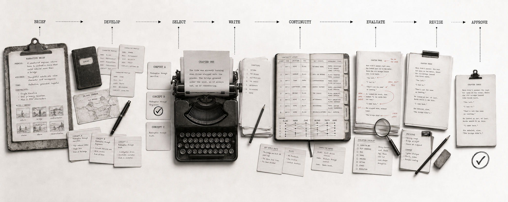

# Narrative Production Skills



**Develop complete AI-assisted narratives, not isolated text generations.**

Narrative Production Skills gives AI coding agents a production workflow for turning a brief into a coherent short story, manuscript, screenplay, or reusable story package.

It supports the full narrative-production process:

- **Story development**: briefs, premise exploration, concepts, story direction
- **Characters and world**: story-relevant character profiles, relationships, rules and constraints
- **Structure**: outlines, beats, scene cards, setup/payoff and causal progression
- **Writing**: rough scenes, refined prose, dialogue, chapters and screenplays
- **Continuity**: canon, planned events, character beliefs, secrets and uncertainty
- **Editorial**: developmental evaluation, revision planning and targeted rewriting

The workflow is designed to explore uncertainty at low resolution, select and approve creative decisions, preserve continuity, write from persistent artifacts, evaluate at the right narrative level, and revise only what actually needs to change.

## Creative control

Selection and approval are different decisions.

- **Selection** means: keep developing this direction.
- **Approval** means: preserve this decision downstream unless it is explicitly reopened.

Rejected candidates should not silently influence later work. Approved character behaviour, world rules, endings, reveals, or other creative decisions become constraints rather than suggestions.

When a story needs to change, the workflow reopens the smallest useful decision and identifies the affected descendants instead of regenerating everything from the original brief.

```text
approved decision
→ new narrative evidence
→ explicit reopen
→ alternative / refinement
→ selection
→ revise affected material only
```

Planned material is also kept separate from established canon. An event in an outline is not treated as something that has already happened in the story.

## Install

The public GitHub owner and repository name are not verified yet, so publication commands intentionally use `<org>/<repo>`.

Install the full narrative workflow for Claude Code:

```bash
npx skills add <org>/<repo> \
  --skill narrative-develop \
  --skill narrative-write \
  --skill narrative-continuity \
  --skill narrative-evaluate \
  --skill narrative-revise \
  --agent claude-code
```

For Codex, use `--agent codex` instead.

Inspect before installing:

```bash
npx skills add <org>/<repo> --list
```

Install only what a project needs:

```bash
npx skills add <org>/<repo> \
  --skill narrative-develop \
  --skill narrative-evaluate \
  --agent claude-code
```

Project-local installation is the default. Global installation is optional:

```bash
npx skills add <org>/<repo> --global
```

Track and update installed skills with:

```bash
npx skills list
npx skills check
npx skills update
npx skills generate-lock
```

## Quick start — The Unscheduled Train

Start with one short story and learn the complete narrative-production loop.

```text
Use Narrative Production Skills to develop a 2,000-word speculative short story.

Premise:
A night-shift railway dispatcher sees a train identifier moving across the network that exists nowhere in the timetable.

Requirements:
- Genre: speculative mystery
- Tone: restrained, tense, grounded
- Point of view: close third person
- Setting: one night in a regional rail control room
- Length: about 2,000 words
- The supernatural element should remain ambiguous until late in the story
- Avoid exposition-heavy world building

Workflow:
- Explore three genuinely different story concepts at low resolution
- Compare them and select one direction
- Develop only the character and world information the story actually needs
- Produce a compact complete outline
- Break the story into beats and scene cards where useful
- Draft the story from the approved development artifacts
- Evaluate the draft without rewriting it
- Create a revision plan from the findings
- Revise the smallest sufficient scope
- Preserve unaffected approved decisions

Optimise for:
- causal coherence
- protagonist motivation
- escalating tension
- scene purpose
- continuity
- setup and payoff
- a satisfying but non-expository ending
```

A first project should stay small. For example:

```text
production/
└── narrative/
    ├── brief.md
    ├── concepts.md
    ├── outline.md
    ├── draft.md
    ├── evaluation.md
    └── revision-plan.md
```

Add characters, world, continuity, scene directories, or episode structure only when the story actually needs them.

The important behaviour is:

```text
low-resolution exploration
→ select
→ approve
→ write
→ evaluate
→ revise only affected material
```

## Learn by producing

Progress through increasingly demanding narrative productions. Each level adds a real story-production problem rather than another abstraction.

### Level 1 — Develop and revise one story

**Short story**

[01 — Short Story](examples/01-short-story/README.md)

A night-shift railway dispatcher sees a train identifier that exists nowhere in the timetable.

Learn:

```text
brief
→ concepts
→ selected concept
→ outline
→ rough scene
→ editorial report
→ revision plan
→ revised scene
```

The goal is to prove the complete production loop without introducing continuity infrastructure before it is needed.

### Level 2 — Maintain knowledge and continuity

**Mystery with conflicting beliefs**

[02 — Mystery Continuity](examples/02-mystery-continuity/README.md)

Three witnesses remember the same museum theft differently, and one of them is telling the truth for the wrong reason.

Adds:

- character beliefs and knowledge state;
- secrets and uncertainty;
- planned versus canonical facts;
- continuity-aware context selection;
- revision without leaking information between characters.

Continuity appears because the story now needs it, not because every project starts with a story database.

### Level 3 — Write a screenplay

**Screenplay development**

[03 — Screenplay](examples/03-screenplay/README.md)

A housing officer must interview the tenant of a flat that city records insist has never existed.

Adds:

- scene-card planning;
- screenplay-specific execution;
- Fountain where useful;
- developmental screenplay evaluation;
- targeted scene revision.

The story model remains medium-independent while screenplay execution stays format-specific.

### Level 4 — Manage an episodic story

**Multi-episode narrative**

[04 — Episodic Story](examples/04-episodic-story/README.md)

Each episode follows a different emergency call routed through the same impossible switchboard, while one operator slowly realises the calls come from future disasters.

Adds:

- persistent character arcs;
- episode-level story movement;
- larger continuity state;
- setup and payoff across episodes;
- progressive evaluation rather than waiting for the whole series to be drafted.

### Level 5 — Hand the story to film production

**Cross-domain production**

[05 — Film Handoff](examples/05-film-handoff/README.md)

Learn artifact-based composition between creative-production domains:

```text
Narrative Production Skills
→ story brief
→ character profile
→ world bible
→ screenplay
→ scene plan
        ↓
Video Production Skills
        ↓
optional Music Production Skills
```

Narrative owns story intent and constraints. Video owns visual character design, storyboards, cinematography, shots and assembly. Music owns music production.

No shared runtime API is required.

## Project structure grows with the story

**One controlled story**  
Use a brief, concept material, an outline, the draft, evaluation and revision plan.

**Character knowledge or world state starts to matter**  
Add `characters/`, `world/` and `continuity/` only as needed.

**Scenes need independent planning or revision**  
Add `beats/` and `scenes/`.

**A screenplay becomes the target**  
Add screenplay-specific output while keeping the upstream story model reusable.

**A flat narrative stops scaling**  
Introduce episode, sequence, or other higher-level organisation only when the work requires it.

**Other creative domains contribute**  
Use domain-specific production areas such as:

```text
production/
├── narrative/
├── video/
└── music/
```

Keep the structure lean:

- branch at the smallest creative unit containing the uncertainty;
- preserve selected and approved decisions instead of recreating them from the brief;
- keep lifecycle state separate from decision status;
- treat planned events as planned until established in approved narrative;
- load only the context relevant to the current task;
- create shared or specialised structure only after the work needs it.

## Skills

### `narrative-develop`

Develop the story before full execution: brief interpretation, concept alternatives, characters, world, outline, beats and scene cards.

Use it to answer:

```text
What story are we telling?
What must be true for it to work?
What is the cheapest narrative representation that can resolve the next uncertainty?
```

### `narrative-write`

Write prose or screenplay material from relevant approved artifacts.

Supports rough scenes, refined scenes, chapters, dialogue in context, discovery writing, manuscripts and screenplay execution.

### `narrative-continuity`

Maintain story state and assemble task-relevant context.

It distinguishes:

```text
planned
canonical
character belief
secret
uncertain
superseded
```

### `narrative-evaluate`

Diagnose narrative problems without silently rewriting the work.

Evaluation is developmental and actionable rather than one generic score:

```text
weak prose, sound scene       → revise prose
weak scene, sound beat        → revise scene card and affected scene
unmotivated beat              → revise beat and affected descendants
weak causal middle            → revise the affected outline region
continuity contradiction      → fix the owning story decision, then affected material
```

### `narrative-revise`

Turn evaluation findings or direct feedback into bounded revision plans and targeted changes.

The governing rule is:

> **Correct the highest upstream cause of the failure, but regenerate only downstream material actually affected.**

## Execution

The skills decide **what narrative-production work is needed**. The host AI agent performs language generation and reasoning.

Core Narrative Production Skills require no provider-specific model API.

Optional deterministic tools may support specialised operations:

- **Fountain-compatible tooling** — screenplay parsing, validation and interchange
- **Pandoc** — manuscript/document conversion
- **Vale / LanguageTool** — optional mechanical language checks

The project does not require an MCP server, vector database, graph database, model router, or multi-agent orchestration runtime.

> **Explore uncertainty at the cheapest narrative resolution capable of resolving it.**
>
> **Preserve approved decisions and change only what needs to change.**

## Testing and benchmarks

Repository checks and narrative-quality evaluation are deliberately separate.

Current scaffold checks:

```bash
pnpm install
pnpm run check
pnpm run validate
pnpm test
pnpm run smoke:install
```

The testing specification defines additional contract, eval and benchmark layers for behaviours such as:

- approved-decision preservation;
- rejected-candidate leakage;
- planned versus canonical state;
- character knowledge and secrets;
- world-rule violations;
- structural root-cause diagnosis;
- smallest sufficient revision scope;
- evaluation versus rewriting;
- screenplay/visual-production boundaries.

Semantic benchmark collection is opt-in and separate from deterministic CI. No benchmark result should be reported until it has actually been measured.

## Documentation

### Specifications

- [Creative Skills System Specification](docs/01-creative-skills-system-spec.md)
  - [Production Principles](docs/01-creative-skills-system-spec.md#7-production-principles)
  - [System Architecture](docs/01-creative-skills-system-spec.md#8-system-architecture)
  - [Core Skills](docs/01-creative-skills-system-spec.md#10-core-skills)
  - [Draft Strategy](docs/01-creative-skills-system-spec.md#17-draft-strategy)
  - [Context Assembly](docs/01-creative-skills-system-spec.md#18-context-assembly)
  - [Retry and Escalation](docs/01-creative-skills-system-spec.md#25-retry-and-escalation)
- [Creative Skills Workflows and Artifacts Specification](docs/02-creative-skills-workflows-and-artifacts-spec.md)
  - [Production Axes](docs/02-creative-skills-workflows-and-artifacts-spec.md#2-production-axes)
  - [Draft Sets](docs/02-creative-skills-workflows-and-artifacts-spec.md#5-draft-sets)
  - [Selection](docs/02-creative-skills-workflows-and-artifacts-spec.md#6-selection)
  - [Approval](docs/02-creative-skills-workflows-and-artifacts-spec.md#7-approval)
  - [First-Class Artifacts](docs/02-creative-skills-workflows-and-artifacts-spec.md#11-first-class-artifacts)
  - [Canonical Development Workflow](docs/02-creative-skills-workflows-and-artifacts-spec.md#27-canonical-development-workflow)
  - [Evaluation Lifecycle](docs/02-creative-skills-workflows-and-artifacts-spec.md#39-evaluation-lifecycle)
  - [Revision Workflow](docs/02-creative-skills-workflows-and-artifacts-spec.md#41-revision-workflow)
- [Creative Skills Repository and Contracts Specification](docs/03-creative-skills-repository-and-contracts-spec.md)
  - [Repository Structure](docs/03-creative-skills-repository-and-contracts-spec.md#2-repository-structure)
  - [Skill Packaging Rule](docs/03-creative-skills-repository-and-contracts-spec.md#3-skill-packaging-rule)
  - [Skill Evals](docs/03-creative-skills-repository-and-contracts-spec.md#16-skill-evals)
  - [End-to-End Evals](docs/03-creative-skills-repository-and-contracts-spec.md#23-end-to-end-evals)
  - [Consumer Project Structure and Progressive Examples](docs/03-creative-skills-repository-and-contracts-spec.md#25-consumer-project-structure-and-progressive-examples)
  - [Canonical Installation Mechanism](docs/03-creative-skills-repository-and-contracts-spec.md#29-canonical-installation-mechanism)
- [Testing and Benchmark Specification](docs/04-testing-and-benchmark-spec.md)
  - [Testing Layers](docs/04-testing-and-benchmark-spec.md#2-testing-layers)
  - [Defect Taxonomy](docs/04-testing-and-benchmark-spec.md#4-defect-taxonomy)
  - [Runbook](docs/04-testing-and-benchmark-spec.md#5-runbook)
  - [Deterministic Contract Tests](docs/04-testing-and-benchmark-spec.md#6-deterministic-contract-tests)
  - [Semantic Benchmark](docs/04-testing-and-benchmark-spec.md#7-semantic-benchmark)
  - [Initial Benchmark Cases](docs/04-testing-and-benchmark-spec.md#8-initial-benchmark-cases)
  - [Known Blind Spots Before the First Baseline](docs/04-testing-and-benchmark-spec.md#14-known-blind-spots-before-the-first-baseline)

### Project-family evolution

- [Extraction Candidates](docs/extraction-candidates.md) — cross-domain concepts observed for possible future extraction, not shared abstractions today.

## Project status

Bootstrap Stage 12 is complete.

Before publication, Stage 13 must prove local validation: TypeScript checks, deterministic tests, Skills CLI discovery, independent installation of every intended skill, and clean consumer-project smoke tests.

No blocked validation gate is treated as passed.

## Licence

MIT. See [LICENSE](LICENSE).
